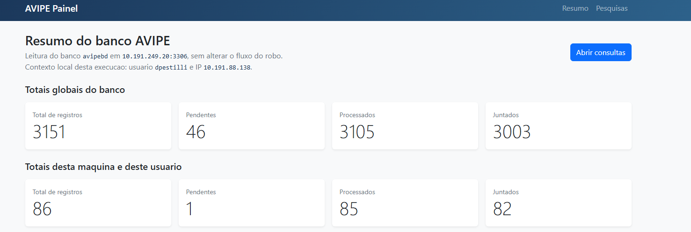
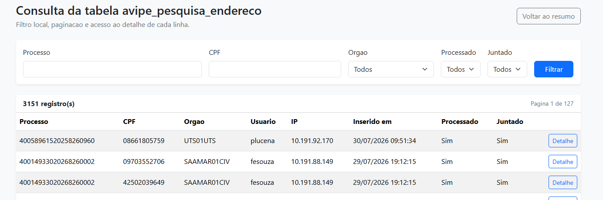

# AVIPE Painel

Painel web local em Django para consulta do banco `avipebd` usado pelo AVIPE.

O projeto foi pensado para ficar dentro de uma cópia funcional do repositório `TJSP_AVIPE`, reutilizando o `config.ini` e o mesmo modelo de acesso ao MySQL e ao Azure Key Vault.

## Visão geral

O painel entrega uma interface simples para acompanhamento operacional do AVIPE, com foco em leitura do banco interno e sem alterar o fluxo principal do robô.

Principais recursos:
- totais globais do banco;
- totais da máquina e do usuário local;
- host, porta e banco em uso;
- últimos registros inseridos;
- consulta paginada da tabela `avipe_pesquisa_endereco`;
- filtros por processo, CPF, órgão, usuário, data de inserção, processado e juntado;
- detalhe completo por registro.

## Capturas de tela

### Resumo do banco



### Consulta com filtros



## Requisitos

- Windows
- Python compatível com o projeto
- uma cópia funcional do repositório `TJSP_AVIPE`
- acesso ao banco `avipebd`
- uma destas opções de credencial:
  - Azure Key Vault via `AZURE_CLIENT_ID`, `AZURE_TENANT_ID` e `AZURE_CLIENT_SECRET`
  - `config.local.ini` com a senha literal do `mysql_avipe`
  - variável `AVIPE_PAINEL_MYSQL_AVIPE_PASSWORD`

## Estrutura esperada

O painel deve ficar dentro da pasta do projeto AVIPE:

```text
TJSP_AVIPE/
|-- config.ini
|-- ...
`-- avipe_painel/
```

## Onde clonar

O `avipe_painel` nao deve ser clonado isoladamente em qualquer pasta.

Ele precisa ficar dentro de uma copia ja existente do repositório `TJSP_AVIPE`, porque depende do `config.ini` e da estrutura do AVIPE ao lado.

### Se o usuario ja tem o TJSP_AVIPE

Entrar na pasta do `TJSP_AVIPE` e clonar o painel ali dentro:

```powershell
cd C:\caminho\para\TJSP_AVIPE
git clone https://github.com/davidpestilli/avipe_painel.git
```

Resultado esperado:

```text
C:\caminho\para\TJSP_AVIPE\avipe_painel
```

### Se o usuario ainda nao tem o TJSP_AVIPE

Primeiro ele precisa obter uma copia funcional do `TJSP_AVIPE`.

So depois deve colocar o `avipe_painel` dentro dessa estrutura.

Se o `avipe_painel` for clonado fora da arvore do AVIPE, ele nao encontra `..\config.ini` e nao consegue funcionar corretamente.

## Antes de clonar

Para clonar o repositório, o usuario precisa ter:
- `git` instalado na maquina;
- acesso ao GitHub;
- permissao para usar o terminal ou PowerShell local.

Para verificar se o `git` esta instalado:

```powershell
git --version
```

Se esse comando falhar, o clone nao vai funcionar ate o `git` ser instalado.

## Erros comuns ao clonar

### `git` nao e reconhecido

Exemplo comum:

```text
git : O termo 'git' nao e reconhecido...
```

Significa que o `git` nao esta instalado ou nao esta disponivel no PATH da maquina.

### Repositorio nao encontrado

Exemplo comum:

```text
remote: Repository not found.
fatal: repository '...' not found
```

Normalmente significa uma destas situacoes:
- URL digitada incorretamente;
- nome do repositório incorreto;
- conta sem acesso ao repositório, quando ele nao e publico;
- tentativa de usar uma URL antiga apos rename do repositório.

### Falha de autenticacao no GitHub

Exemplo comum:

```text
fatal: Authentication failed
```

Para este projeto, isso tende a acontecer apenas se a pessoa tentar usar uma forma de acesso autenticado sem estar logada corretamente no GitHub.

Se o repositório estiver publico, o clone por HTTPS normalmente nao exige login apenas para baixar.

### Clone feito na pasta errada

Mesmo que o clone funcione, o painel nao vai funcionar direito se for baixado fora da estrutura do `TJSP_AVIPE`.

O sintoma mais comum depois e erro porque o painel nao encontra:

```text
..\config.ini
```

### Pasta ja existe

Exemplo comum:

```text
fatal: destination path 'avipe_painel' already exists and is not an empty directory.
```

Isso significa que a pasta `avipe_painel` ja existe no local escolhido.

Nesse caso, a pessoa deve:
- usar a pasta ja existente, se ela for a correta;
- ou remover/renomear a pasta antiga antes de clonar novamente.

## Instalação

Dentro da pasta `avipe_painel`:

```powershell
python -m venv .venv
.venv\Scripts\python.exe -m pip install -r requirements.txt
.venv\Scripts\python.exe manage.py migrate
```

## Como iniciar

### Opção 1. Atalho rápido

Use:

```powershell
.\iniciar_avipe_painel.bat
```

Esse arquivo:
- verifica se existe `.venv`;
- verifica se existe `..\config.ini`;
- verifica se há algum caminho de credencial disponível;
- executa `manage.py check`;
- cria o `db.sqlite3` local do Django se ele ainda não existir;
- sobe o servidor local.

Depois, abra:

- `http://127.0.0.1:8000/`

### Opção 2. Execução manual

```powershell
.\.venv\Scripts\activate
python manage.py runserver
```

## Credenciais

### Azure Key Vault

Se o `config.ini` do AVIPE usa segredos com prefixo `kv:`, o painel pode usar o mesmo fluxo do AVIPE por meio destas variáveis de ambiente:

- `AZURE_CLIENT_ID`
- `AZURE_TENANT_ID`
- `AZURE_CLIENT_SECRET`

### Override local

Se preferir não depender do Azure localmente, crie um arquivo `config.local.ini` ao lado do `manage.py`, usando como base `config.local.ini.example`.

Exemplo:

```ini
[mysql_avipe]
password = sua_senha_aqui
```

Também é possível definir:

- `AVIPE_PAINEL_MYSQL_AVIPE_PASSWORD`

## Checagem inicial

O arquivo `iniciar_avipe_painel.bat` faz uma checagem inicial antes de subir o servidor.

Ele verifica:
- existência de `.venv\Scripts\python.exe`;
- existência de `..\config.ini`;
- disponibilidade de uma forma de autenticação local;
- validade estrutural da aplicação com `manage.py check`;
- existência do banco local `db.sqlite3`;
- criação inicial do `db.sqlite3`, se necessário.

Ele não garante sozinho:
- acesso real ao MySQL pela rede;
- senha correta;
- acesso efetivo ao Key Vault;
- permissão real de leitura no banco.

Esses pontos continuam sendo validados quando o painel abre os dados.

## Observações importantes

- o painel é somente leitura;
- o ajuste de horário é feito apenas na exibição do front, em `America/Sao_Paulo`;
- a navegação de detalhe usa o `id` do registro para evitar falhas por formatação de data;
- o projeto foi testado após atualização do AVIPE por `git pull` e continuou funcional.

## O que não deve ser versionado

Já está coberto pelo `.gitignore`:

- `.venv/`
- `db.sqlite3`
- `config.local.ini`
- `consultas/`
- logs e caches locais

## Arquivos principais

- `pesquisas/services.py`: acesso ao banco e consultas
- `pesquisas/views.py`: preparação das telas
- `templates/pesquisas/`: interface HTML
- `iniciar_avipe_painel.bat`: inicialização rápida
- `MEMORIA_IMPLEMENTACAO.md`: histórico técnico e memória de evolução

## Solução de problemas

### O painel não consegue abrir os dados

Verifique:
- se o `config.ini` do AVIPE está presente na pasta pai;
- se o acesso ao MySQL `avipebd` está disponível na rede;
- se o Azure Key Vault está acessível, quando o `config.ini` usa `kv:`;
- se as variáveis `AZURE_CLIENT_ID`, `AZURE_TENANT_ID` e `AZURE_CLIENT_SECRET` estão visíveis na sessão atual;
- ou, alternativamente, se `config.local.ini` foi criado corretamente.

### O painel abre, mas os horários parecem incorretos

O front converte os horários exibidos para `America/Sao_Paulo`. Isso não altera o banco, apenas a apresentação.

### O AVIPE foi atualizado e o painel deixou de funcionar

O painel foi desenhado para continuar funcional após atualizações do AVIPE, mas mudanças no schema da tabela `avipe_pesquisa_endereco` ou na política de segredos podem exigir ajustes.
